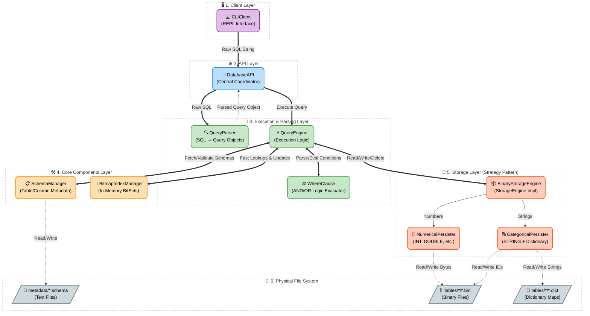
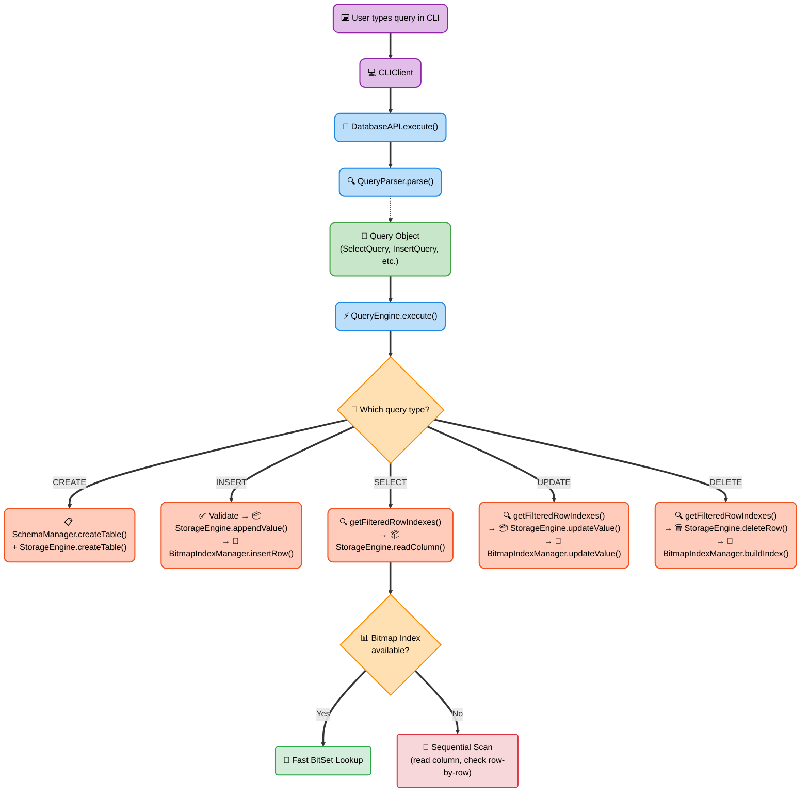
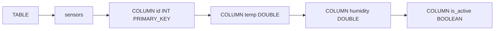
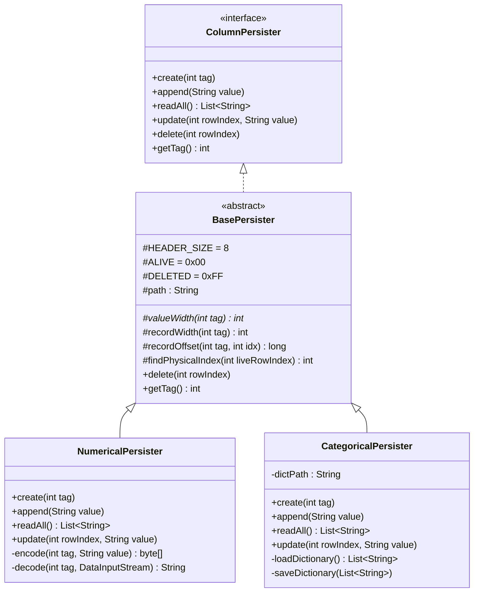
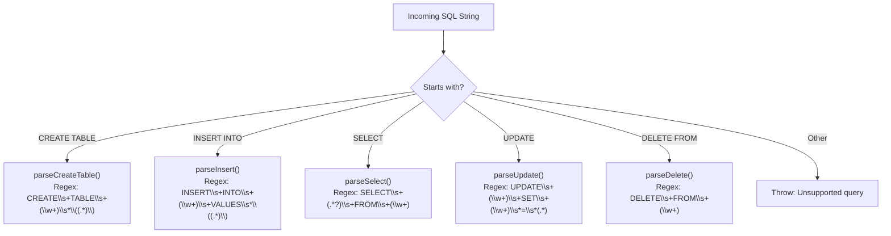
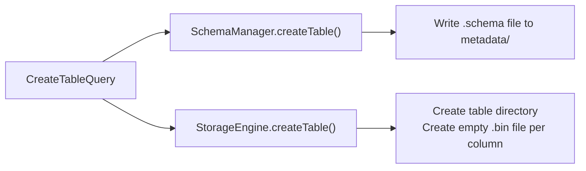
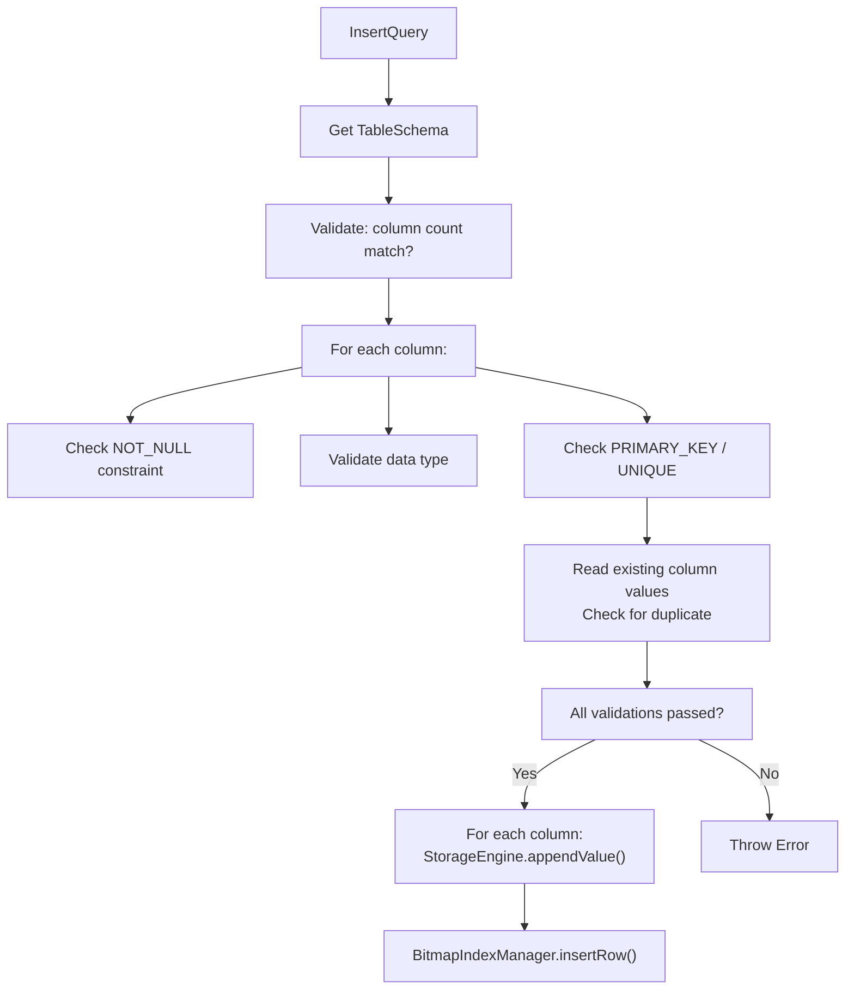
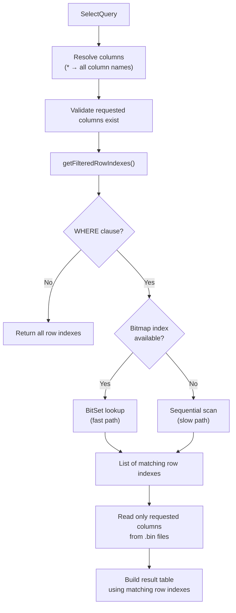
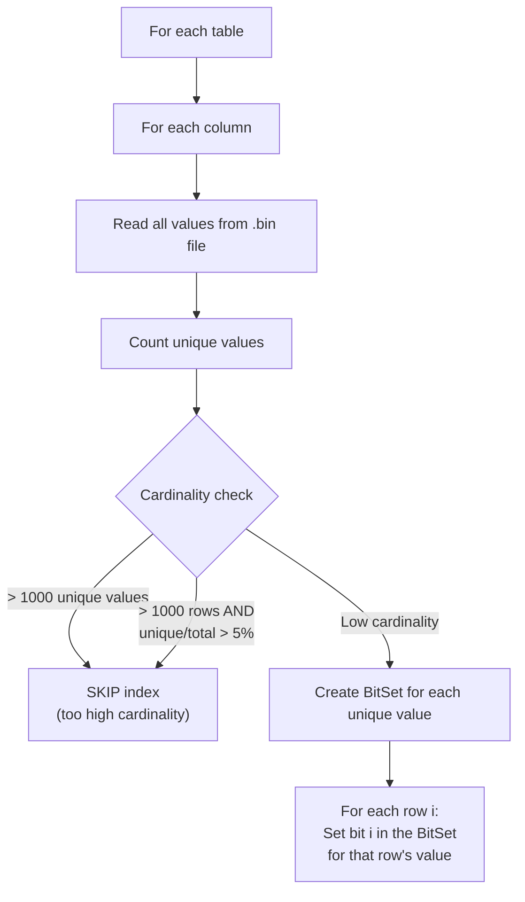

# 🎓 Column-Store Database

> **Project**: Column-Store Data Storage System  
> **Language**: Java (pure Java I/O — no external libraries)  
> **Entry Point**: `cdb.client.CLIClient`

---

## Table of Contents

1. [What is a Column-Store Database?](#1-what-is-a-column-store-database)
2. [Project Architecture — The Big Picture](#2-project-architecture--the-big-picture)
3. [Package & File Map](#3-package--file-map)
4. [Schema Layer (DDL)](#4-schema-layer-ddl)
5. [Storage Layer — Binary Column Files](#5-storage-layer--binary-column-files)
6. [Query Parser](#6-query-parser--how-queries-are-understood)
7. [Query Engine — Execution](#7-query-engine--execution)
8. [WHERE Clause & AND/OR Logic](#8-where-clause--andor-logic)
9. [Bitmap Indexing](#9-bitmap-indexing)
10. [JOIN Support (INNER JOIN, LEFT JOIN)](#10-join-support-inner-join-left-join)
11. [Aggregation & GROUP BY](#11-aggregation--group-by)
12. [ORDER BY, LIMIT & OFFSET](#12-order-by-limit--offset)
13. [Enhanced WHERE Operators (IN, BETWEEN, LIKE, NOT, IS NULL)](#13-enhanced-where-operators-in-between-like-not-is-null)
14. [CLI Client](#14-cli-client)
15. [Binary Schema Persistence](#15-binary-schema-persistence)
16. [Utility & Testing](#16-utility--testing)
17. [Sample Demonstrations](#17-sample-demonstrations)
18. [Likely Viva Questions & Answers](#18-likely-viva-questions--answers)

---

## 1. What is a Column-Store Database?

### Row-Store (Traditional) vs Column-Store

In a **row-store** database (like MySQL), one row of data is stored together:

```
Row 1:  [1, "Alice", "Engineering", 80000]
Row 2:  [2, "Bob",   "HR",          50000]
Row 3:  [3, "Charlie","Engineering", 90000]
```

In a **column-store** database (like this project), each **column** is stored in its own separate file:

```
id.bin:      [1, 2, 3]
name.bin:    ["Alice", "Bob", "Charlie"]
dept.bin:    ["Engineering", "HR", "Engineering"]
salary.bin:  [80000, 50000, 90000]
```

### Why Column-Store?

| Advantage | Explanation |
|-----------|-------------|
| **Fast analytical queries** | If you run `SELECT salary FROM employees`, only the `salary.bin` file is read — the other columns are never touched |
| **Better compression** | Same data type in a file compresses much better (e.g., a column of integers) |
| **Bitmap indexing fits naturally** | Since each column is separate, creating per-column indexes is straightforward |
| **Reduced I/O** | You only read the columns you need, saving disk and memory |

> [!IMPORTANT]
> **Key takeaway for viva**: Column-stores are optimized for *reading specific columns* across many rows (analytical workloads), while row-stores are optimized for *reading/writing entire rows* (transactional workloads).

---

## 2. Project Architecture — The Big Picture

### 2.1 Whole Project Architecture Pipeline

This diagram shows the layered architecture of the entire system, from the user interface down to the physical file system:



### 2.2 Query Execution Flow

Here is the complete flow of how a query travels through the system:



### The 6 Packages

| Package | Responsibility |
|---------|---------------|
| `cdb.client` | CLI interface — reads user input, routes commands |
| `cdb.api` | DatabaseAPI — central coordinator that wires everything together |
| `cdb.ddl` | Schema definitions — `TableSchema`, `ColumnSchema`, `SchemaManager` |
| `cdb.storage` | Binary storage engine — reading/writing `.bin` column files |
| `cdb.storage.persistence` | Low-level binary I/O — Numerical and Categorical persisters |
| `cdb.query` | Query parsing, execution engine, bitmap index manager |
| `cdb.query.querytypes` | Data classes for each query type + WHERE clause |
| `cdb.util` | File utilities, stress tester |

---

## 3. Package & File Map

```
Column-Store-Data-Storage-System/
├── cdb/
│   ├── api/
│   │   └── DatabaseAPI.java          ← Central coordinator
│   ├── client/
│   │   └── CLIClient.java            ← Command-line interface
│   ├── ddl/
│   │   ├── ColumnSchema.java         ← One column's metadata (name, type, constraints)
│   │   ├── TableSchema.java          ← Full table metadata (list of columns)
│   │   └── SchemaManager.java        ← Reads/writes .schema files
│   ├── query/
│   │   ├── QueryParser.java          ← Converts SQL string → Query object
│   │   ├── QueryEngine.java          ← Executes Query objects
│   │   ├── BitmapIndexManager.java   ← Bitmap index creation & lookup
│   │   └── querytypes/
│   │       ├── Query.java            ← Marker interface
│   │       ├── CreateTableQuery.java
│   │       ├── InsertQuery.java
│   │       ├── SelectQuery.java
│   │       ├── UpdateQuery.java
│   │       ├── DeleteQuery.java
│   │       ├── ShowIndexQuery.java
│   │       ├── WhereClause.java      ← Multi-condition WHERE logic
│   │       └── WhereCondition.java   ← Single condition (col op val)
│   ├── storage/
│   │   ├── StorageEngine.java        ← Interface (contract)
│   │   ├── BinaryStorageEngine.java  ← Implementation using binary files
│   │   └── persistence/
│   │       ├── ColumnPersister.java   ← Interface for column-level I/O
│   │       ├── BasePersister.java     ← Shared logic (header, delete, find)
│   │       ├── NumericalPersister.java← Handles INT, DOUBLE, FLOAT, etc.
│   │       └── CategoricalPersister.java ← Handles STRING with dictionary encoding
│   └── util/
│       ├── FileUtils.java            ← Directory/file helpers
│       ├── StressTester.java         ← Automated edge-case tests
│       └── TestCategoricalData.java  ← Integration test for string columns
└── databases/
    └── company_db/
        ├── metadata/
        │   ├── employees.schema      ← Schema definition file
        │   └── products.schema       ← Schema definition file
        └── tables/
            ├── employees/
            │   ├── department.bin    ← STRING column (binary, dict encoded)
            │   ├── department.dict   ← Dictionary for department
            │   ├── id.bin            ← INT column (binary)
            │   ├── is_active.bin     ← BOOLEAN column (binary)
            │   ├── name.bin          ← STRING column (binary, dict encoded)
            │   ├── name.dict         ← Dictionary for name
            │   └── salary.bin        ← DOUBLE column (binary)
            └── products/
                ├── category.bin      ← STRING column (binary, dict encoded)
                ├── category.dict     ← Dictionary for category
                ├── pid.bin           ← INT column (binary)
                ├── pname.bin         ← STRING column (binary, dict encoded)
                ├── pname.dict        ← Dictionary for pname
                ├── price.bin         ← FLOAT column (binary)
                └── stock.bin         ← SHORT column (binary)
```

---

## 4. Schema Layer (DDL)

### What the Schema Layer Does

The schema layer is responsible for **defining the structure** of tables — what columns exist, what types they are, and what constraints they have. It is NOT responsible for actual data storage.

### Files Involved

#### `ColumnSchema.java` — Represents ONE Column

```java
public class ColumnSchema {
    private String name;              // e.g., "salary"
    private String type;              // e.g., "DOUBLE"
    private List<String> constraints; // e.g., ["PRIMARY_KEY", "NOT_NULL"]
}
```

Think of it as a blueprint for a single column. It knows:
- The column's **name** (e.g., `id`, `name`, `salary`)
- The column's **data type** (e.g., `INT`, `STRING`, `DOUBLE`)
- Any **constraints** (e.g., `PRIMARY_KEY`, `UNIQUE`, `NOT_NULL`)

#### `TableSchema.java` — Represents ONE Table

```java
public class TableSchema {
    private String tableName;           // e.g., "employees"
    private List<ColumnSchema> columns; // all columns in order
}
```

A `TableSchema` is simply a list of `ColumnSchema` objects grouped under a table name.

#### `SchemaManager.java` — Manages All Schemas

This is the **controller** for all schema operations:

1. **On startup** → Scans the `metadata/` folder for `.schema` files and loads them into a `HashMap<String, TableSchema>`
2. **On CREATE TABLE** → Serializes the schema into a `.schema` file and saves it to disk
3. **On demand** → Provides `getTable(name)` to look up a table's structure

### Schema File Format

Schemas are stored as plain text in the `metadata/` directory:

```
TABLE sensors COLUMN id INT PRIMARY_KEY COLUMN temp DOUBLE COLUMN humidity DOUBLE COLUMN is_active BOOLEAN
```

**Parsing logic** (in `parseSchemaString()`):
1. Split the text by whitespace
2. First token must be `TABLE`, second is the table name
3. Every time you hit `COLUMN`, the next two tokens are column name and type
4. Any tokens after those two (until the next `COLUMN`) are constraints



> [!TIP]
> **For viva**: Schema files are the "blueprint" — they tell the system what structure a table should have. The actual data lives separately in `.bin` files.

---

## 5. Storage Layer — Binary Column Files

### The Interface Pattern

The project uses the **Strategy Pattern**: there is an interface `StorageEngine` and a concrete implementation `BinaryStorageEngine`.

```java
public interface StorageEngine {
    List<String> readColumn(String table, String column) throws IOException;
    void appendValue(String table, String column, String value) throws IOException;
    void updateValue(String table, String column, int rowIndex, String value) throws IOException;
    void deleteRow(String table, int rowIndex) throws IOException;
    void createTable(TableSchema schema) throws IOException;
    void dropTable(String table) throws IOException;
}
```

> [!NOTE]
> This design means you could easily swap in a different storage implementation (e.g., text-based, compressed, etc.) without changing any other code. This is a key OOP design principle — **programming to an interface**.

### Binary File Format

Each column is stored as a **single `.bin` file**. The file format:

```
┌──────────────────────────────────────────┐
│ HEADER (8 bytes)                         │
│   ├── Type Tag (4 bytes, int)            │  ← What data type? (INT=3, DOUBLE=6, STRING=9, etc.)
│   └── Record Count (4 bytes, int)        │  ← Total number of records (including deleted)
├──────────────────────────────────────────┤
│ RECORD 0                                 │
│   ├── Flag (1 byte)                      │  ← 0x00 = ALIVE, 0xFF = DELETED (tombstone)
│   └── Value (N bytes, type-dependent)    │  ← The actual data
├──────────────────────────────────────────┤
│ RECORD 1                                 │
│   ├── Flag (1 byte)                      │
│   └── Value (N bytes)                    │
├──────────────────────────────────────────┤
│ ...                                      │
└──────────────────────────────────────────┘
```

### The Type Tag System

| Type Tag | SQL Type | Width (bytes) | Java Type |
|----------|----------|---------------|-----------|
| 1 | BYTE | 1 | `byte` |
| 2 | SHORT | 2 | `short` |
| 3 | INT / INTEGER | 4 | `int` |
| 4 | LONG / BIGINT | 8 | `long` |
| 5 | FLOAT / REAL | 4 | `float` |
| 6 | DOUBLE / DECIMAL | 8 | `double` |
| 7 | BOOLEAN / BOOL | 1 | `byte` (0 or 1) |
| 8 | BIGDECIMAL / NUMERIC | 20 | `BigDecimal` |
| 9 | STRING / VARCHAR / TEXT | 4 | Dictionary ID (`int`) |

### The Persister Hierarchy



### NumericalPersister — How Numbers Are Stored

For numeric types (INT, DOUBLE, FLOAT, etc.), the values are directly written as **raw binary bytes**.

**Example**: Storing `[42, 99, 7]` in an INT column:

```
Bytes: [00 00 00 03] [00 00 00 03]  ← Header: tag=3 (INT), count=3
       [00] [00 00 00 2A]           ← Record 0: ALIVE, value=42
       [00] [00 00 00 63]           ← Record 1: ALIVE, value=99
       [00] [00 00 00 07]           ← Record 2: ALIVE, value=7
```

- **Encode**: Converts a `String` value like `"42"` → parses it to an `int` → writes 4 bytes using `DataOutputStream`
- **Decode**: Reads 4 bytes using `DataInputStream.readInt()` → converts back to `String`

### CategoricalPersister — How Strings Are Stored (Dictionary Encoding)

Strings are NOT stored directly in the `.bin` file. Instead, the system uses **dictionary encoding**:

1. A separate **dictionary file** (`.dict`) maps each unique string to a numeric ID
2. The `.bin` file stores only the **4-byte integer IDs**

**Example**: Storing `["Engineering", "HR", "Engineering"]`:

**Dictionary file** (`dept.dict`):
```
0 → "Engineering"
1 → "HR"
```

**Binary file** (`dept.bin`):
```
Bytes: [00 00 00 09] [00 00 00 03]  ← Header: tag=9 (STRING), count=3
       [00] [00 00 00 00]           ← Record 0: ALIVE, dict_id=0 → "Engineering"
       [00] [00 00 00 01]           ← Record 1: ALIVE, dict_id=1 → "HR"
       [00] [00 00 00 00]           ← Record 2: ALIVE, dict_id=0 → "Engineering"
```

> [!TIP]
> **Why dictionary encoding?** If "Engineering" appears 1000 times, instead of storing the full string 1000 times, we store the 4-byte ID `0` 1000 times. This saves massive space and makes the column fixed-width so random access is possible.

### The Tombstone Delete Mechanism

When a row is deleted, the system does **NOT** physically remove the bytes from the file. Instead:

1. It finds the physical record position
2. Changes the 1-byte flag from `ALIVE (0x00)` to `DELETED (0xFF)`
3. On `readAll()`, deleted records are automatically **skipped**

```
Before delete:    [00] [00 00 00 2A]   ← ALIVE, value=42
After delete:     [FF] [00 00 00 2A]   ← DELETED (tombstone), value still there but ignored
```

### The Physical Index vs Logical Index Problem

Because of tombstone deletion, there's a gap between:
- **Logical index**: What the user sees (row 0, 1, 2, ...)
- **Physical index**: Actual byte position in the file

The `findPhysicalIndex(int liveRowIndex)` method in `BasePersister` handles this by scanning from the start, counting only ALIVE records until it reaches the requested logical index.

```
Physical:  [ALIVE] [DELETED] [ALIVE] [ALIVE] [DELETED] [ALIVE]
Logical:      0       -        1        2       -        3
```

---

## 6. Query Parser — How Queries Are Understood

### What the Parser Does

The `QueryParser` takes a raw SQL string and converts it into a structured **Query object** that the engine can execute.

```
"SELECT name, salary FROM employees WHERE dept = 'HR'"
                        ↓ QueryParser.parse()
SelectQuery {
    tableName: "employees",
    columns: ["name", "salary"],
    whereClause: WhereClause {
        conditions: [WhereCondition("dept", "=", "HR")],
        logicalOp: AND
    }
}
```

### Parsing Strategy

The parser uses **regex (regular expressions)** and **string splitting**:



### How the WHERE Clause is Parsed

This happens in two steps:

**Step 1: `splitWhereClause()`** — Splits the query at the `WHERE` keyword:
```
"SELECT * FROM emp WHERE salary > 50000"
   → mainPart: "SELECT * FROM emp"
   → whereStr: "salary > 50000"
```

**Step 2: `parseWhereClause()`** — Parses the WHERE string:
1. Check if the string contains `AND` or `OR` keywords
2. Split the string on that keyword to get individual conditions
3. For each condition, use the regex `(\w+)\s*(>=|<=|!=|[=><])\s*(.+)` to extract column, operator, and value
4. Return a `WhereClause` object containing a list of `WhereCondition` objects

**Example with AND**:
```
"salary > 50000 AND dept = 'HR'"
   → Split on AND → ["salary > 50000", "dept = 'HR'"]
   → WhereCondition("salary", ">", "50000")
   → WhereCondition("dept", "=", "HR")
   → WhereClause(conditions=[...], logicalOp=AND)
```

### Supported Operators

| Operator | Meaning |
|----------|---------|
| `=` | Equal to |
| `!=` | Not equal to |
| `>` | Greater than |
| `<` | Less than |
| `>=` | Greater than or equal to |
| `<=` | Less than or equal to |

---

## 7. Query Engine — Execution

The `QueryEngine` receives a parsed `Query` object and executes it. Here is the step-by-step flow for each query type:

### CREATE TABLE Execution



1. `SchemaManager.createTable()` → serializes `TableSchema` to a `.schema` file in `metadata/`
2. `BinaryStorageEngine.createTable()` → creates a directory for the table under `tables/`, and for each column, creates an empty `.bin` file with just the 8-byte header (type tag + count=0)

### INSERT Execution



**Key detail**: Validation happens **before any writes**. This ensures atomicity — either all columns get the new value, or none do.

### SELECT Execution



### UPDATE Execution

1. Find matching rows using `getFilteredRowIndexes()` (same WHERE logic as SELECT)
2. For each matching row:
   - Call `storageEngine.updateValue()` → overwrites the bytes at that row position
   - Call `indexManager.updateValue()` → updates the bitmap index (unset old bit, set new bit)

### DELETE Execution

1. Find matching rows using `getFilteredRowIndexes()`
2. Delete rows **from bottom to top** (to preserve row indexes during deletion)
3. For each row: Call `storageEngine.deleteRow()` → sets the tombstone flag (0xFF) across all column files
4. After all deletions: Call `indexManager.buildIndex()` → completely rebuilds the bitmap index (because row positions have shifted)

> [!IMPORTANT]
> **Why delete from bottom to top?** If you delete row 2 first, then row 5 becomes row 4 (because a live row is removed). By deleting from the highest index downward, earlier indexes remain valid until you process them.

---

## 8. WHERE Clause & AND/OR Logic

### Data Classes

```
WhereCondition: Represents ONE condition like "salary > 50000"
    - column: "salary"
    - op: ">"
    - value: "50000"

WhereClause: Represents the FULL WHERE clause
    - conditions: [WhereCondition, WhereCondition, ...]
    - logicalOp: AND or OR
```

### How Conditions Are Evaluated

The `evaluateCondition()` method in `QueryEngine`:

1. **Try numeric comparison first**: Parse both values as `double`, then use `==`, `!=`, `>`, `<`, `>=`, `<=`
2. **Fall back to string comparison**: If parsing fails (not a number), use `equalsIgnoreCase()` for `=` and `!=`

```java
// Simplified logic:
try {
    double num1 = Double.parseDouble(val1);
    double num2 = Double.parseDouble(val2);
    // numeric comparison: num1 op num2
} catch (NumberFormatException) {
    // string comparison: val1.equalsIgnoreCase(val2)
}
```

### AND Logic (Step by Step)

Query: `SELECT * FROM emp WHERE dept = 'HR' AND salary > 50000`

Row-by-row evaluation with short-circuit:

| Row | dept | salary | `dept='HR'` | `salary>50000` | AND Result |
|-----|------|--------|------------|----------------|------------|
| 0 | Engineering | 80000 | ❌ | — (short-circuited) | ❌ |
| 1 | HR | 50000 | ✅ | ❌ | ❌ |
| 2 | HR | 55000 | ✅ | ✅ | ✅ |
| 3 | Finance | 75000 | ❌ | — (short-circuited) | ❌ |

**AND short-circuit**: As soon as one condition is `false`, skip the rest (result is already `false`).

### OR Logic (Step by Step)

Query: `SELECT * FROM emp WHERE dept = 'Finance' OR name = 'Alice'`

| Row | dept | name | `dept='Finance'` | `name='Alice'` | OR Result |
|-----|------|------|------------------|----------------|-----------|
| 0 | Engineering | Alice | ❌ | ✅ | ✅ |
| 1 | HR | Bob | ❌ | ❌ | ❌ |
| 2 | Engineering | Charlie | ❌ | ❌ | ❌ |
| 3 | Finance | David | ✅ | — (short-circuited) | ✅ |

**OR short-circuit**: As soon as one condition is `true`, skip the rest (result is already `true`).

---

## 9. Bitmap Indexing

### What is a Bitmap Index?

A bitmap index is a **data structure that maps each unique value in a column to a bit-vector** (array of 0s and 1s), where each bit represents one row.

**Example** — Column `dept` with 5 rows: `[Engineering, HR, Engineering, Finance, HR]`

```
Value "Engineering" → BitSet: 1 0 1 0 0
Value "HR"          → BitSet: 0 1 0 0 1
Value "Finance"     → BitSet: 0 0 0 1 0
```

### In-Memory Structure

```java
// Table → Column → Value → BitSet
Map<String, Map<String, Map<String, BitSet>>> indexes;

// Example access:
indexes.get("employees").get("dept").get("HR")  →  BitSet{1, 4}
//  means rows 1 and 4 have dept = "HR"
```

### How a Bitmap Index is Built (`buildIndex()`)



### Cardinality Threshold — Why Skip High-Cardinality Columns?

> [!WARNING]
> A bitmap index works best for **low-cardinality** columns (columns with few unique values — like `dept` with 5 departments).
>
> For **high-cardinality** columns (like `id` with thousands of unique values), the bitmap index wastes memory because you'd have thousands of BitSets, each with mostly 0s.

**The rules**:
- If **unique values > 1000** → Skip the index
- If **rows ≥ 1000** AND **unique/total > 5%** → Skip the index

This check happens:
1. During initial `buildIndex()` at startup
2. Dynamically during `insertRow()` — if the threshold is crossed, the index for that column is **dropped** at runtime

### How Bitmap Index Speeds Up Queries

**Without index** (Sequential Scan):
```
Query: SELECT * FROM emp WHERE dept = 'HR'
Step 1: Read ALL values from dept.bin → [Eng, HR, Eng, Fin, HR]
Step 2: Check each value: row 0? No. row 1? Yes. row 2? No. row 3? No. row 4? Yes.
Step 3: Result rows: [1, 4]
```

**With index** (Bitmap Lookup):
```
Query: SELECT * FROM emp WHERE dept = 'HR'
Step 1: Look up indexes["emp"]["dept"]["HR"] → BitSet{1, 4}
Step 2: Result rows: [1, 4]  ← instant!
```

### AND/OR with Bitmap Index

The **real power** is when combining multiple conditions using **bitwise operations**:

**Query**: `WHERE dept = 'HR' AND salary > 50000`

```
dept = 'HR'      → BitSet: 0 1 0 0 1  (rows 1, 4)
salary > 50000   → BitSet: 1 0 0 1 1  (rows 0, 3, 4)

AND operation (bitwise AND):
  0 1 0 0 1
& 1 0 0 1 1
= 0 0 0 0 1  → Only row 4 matches both!
```

**For OR**: Use bitwise OR instead:
```
  0 1 0 0 1
| 1 0 0 1 1
= 1 1 0 1 1  → Rows 0, 1, 3, 4 match at least one condition
```

> [!TIP]
> **Key viva point**: Bitmap AND/OR operates on entire columns at once — it's like comparing thousands of rows in a single CPU instruction. This is *significantly* faster than checking row-by-row.

### Fallback to Sequential Scan

If **any** column in the WHERE clause doesn't have a bitmap index, the system falls back to a sequential scan for **all** conditions in that query. The console will print:

```
[Bitmap Index] Used fast lookup for emp (2 condition(s) joined by AND), matched 1 logical row(s).
```
or
```
[Sequential Scan] Used full scan for emp (2 condition(s) joined by AND), matched 1 logical row(s).
```

### Keeping the Index Updated

| Operation | Index Action |
|-----------|-------------|
| **INSERT** | Set the new bit in the appropriate BitSet for each column value |
| **UPDATE** | Clear the old value's bit, set the new value's bit |
| **DELETE** | Rebuild the entire index (since row positions shift after deletion) |

---

## 10. JOIN Support (INNER JOIN, LEFT JOIN)

### Overview

The system now supports multi-table queries via JOIN operations. Both `INNER JOIN` and `LEFT JOIN` are implemented using a **nested loop join** strategy.

### Supported JOIN Syntax

```sql
SELECT columns FROM table1 INNER JOIN table2 ON table1.col = table2.col [WHERE ...]
SELECT columns FROM table1 LEFT JOIN table2 ON table1.col = table2.col [WHERE ...]
```

### How JOINs Work in a Column-Store

1. **Column extraction**: All required columns from both tables are read from their respective `.bin` files
2. **Nested loop**: For each row in the left table, the system scans all rows in the right table for matching join keys
3. **Result assembly**: Matching rows are combined into a single result set
4. **LEFT JOIN**: When no match is found for a left-table row, it is still included with NULL values for right-table columns

### Example

```sql
SELECT employees.name, products.pname FROM employees
INNER JOIN products ON employees.id = products.pid
```

**Output**:
```
employees.name	products.pname
-----------------------------------------------------------
Alice	Laptop
Bob	Mouse
...
(7 rows)
```

### Current Limitations

- Table aliases are not yet supported (use full column names)
- Only equality-based join conditions (`ON a.col = b.col`)
- Nested loop join only (no hash join optimization yet)

---

## 11. Aggregation & GROUP BY

### Overview

Aggregation functions compute summary statistics across sets of rows. This is a key feature for analytical workloads where column-stores excel.

### Supported Functions

| Function | Syntax | Description | Example |
|----------|--------|-------------|---------|
| `COUNT` | `COUNT(col)` or `COUNT(*)` | Count non-null values | `SELECT COUNT(*) FROM employees` |
| `SUM` | `SUM(col)` | Sum of numeric values | `SELECT SUM(salary) FROM employees` |
| `AVG` | `AVG(col)` | Average of numeric values | `SELECT AVG(salary) FROM employees` |
| `MIN` | `MIN(col)` | Minimum value | `SELECT MIN(salary) FROM employees` |
| `MAX` | `MAX(col)` | Maximum value | `SELECT MAX(salary) FROM employees` |

### How Aggregation Works

Since this is a column-store, aggregate functions only read the specific column file needed. For example, `AVG(salary)` only reads `salary.bin` — no other column files are touched.

### GROUP BY

Group rows that have the same values in specified columns, then apply aggregate functions per group.

```sql
SELECT department, AVG(salary) FROM employees GROUP BY department
```

**Output**:
```
department	AVG(salary)
-------------------------------
Engineering	88666.67
HR	55000.0
Finance	74500.0
Marketing	66500.0
(4 groups)
```

### Execution Flow

1. Filter rows using WHERE clause (if present)
2. Read the aggregate column and group-by column
3. Partition rows by group key
4. Apply aggregate function within each partition
5. Return one row per group

---

## 12. ORDER BY, LIMIT & OFFSET

### ORDER BY

Sort results by a specified column in ascending (`ASC`) or descending (`DESC`) order.

```sql
SELECT name, salary FROM employees ORDER BY salary DESC
```

The system reads the order-by column, performs a numeric sort (falling back to string comparison for non-numeric data), and reorders the result rows accordingly.

### LIMIT and OFFSET

Restrict the number of result rows:

```sql
SELECT * FROM employees LIMIT 5
SELECT * FROM employees LIMIT 10 OFFSET 2
```

- `LIMIT` restricts the maximum number of rows returned
- `OFFSET` skips a number of rows before returning results
- ORDER BY is applied before LIMIT/OFFSET

### Combined Example

```sql
SELECT name, salary FROM employees WHERE department = 'Engineering'
ORDER BY salary DESC LIMIT 3
```

---

## 13. Enhanced WHERE Operators (IN, BETWEEN, LIKE, NOT, IS NULL)

The WHERE clause has been extended beyond basic comparison operators to support:

### IN / NOT IN

Check if a value matches any value in a list:

```sql
SELECT * FROM employees WHERE department IN ('Engineering', 'Finance')
SELECT * FROM employees WHERE id NOT IN (1, 2, 3)
```

The system evaluates `IN` by checking the cell value against each value in the list. For indexed columns, it falls back to sequential scan.

### BETWEEN / NOT BETWEEN

Check if a value falls within a range (inclusive):

```sql
SELECT * FROM employees WHERE salary BETWEEN 50000 AND 80000
SELECT * FROM employees WHERE id NOT BETWEEN 5 AND 10
```

Both numeric and string comparisons are supported. For numbers, double comparison is used. For strings, lexicographic comparison.

### LIKE / NOT LIKE

Pattern matching with wildcards:
- `%` matches any sequence of characters
- `_` matches any single character

```sql
SELECT * FROM employees WHERE name LIKE 'A%'
SELECT * FROM employees WHERE name NOT LIKE '%e'
```

The `LIKE` pattern is converted to a Java regex for evaluation.

### NOT Operator

Negate any condition by prefixing with `NOT`:

```sql
SELECT * FROM employees WHERE NOT (department = 'HR')
SELECT * FROM employees WHERE NOT (salary > 50000 AND department = 'Engineering')
```

The `NOT` flag on a `WhereCondition` inverts the result of the condition evaluation.

### IS NULL / IS NOT NULL

Check for null or empty values:

```sql
SELECT * FROM employees WHERE name IS NULL
SELECT * FROM employees WHERE salary IS NOT NULL
```

---

## 14. CLI Client

The `CLIClient` is the user-facing component. It provides a REPL (Read-Eval-Print-Loop):

### Commands Handled Directly by CLIClient

| Command | Description |
|---------|-------------|
| `SHOW DATABASES` | Lists all folders in the `databases/` directory |
| `CREATE DATABASE <name>` | Creates a new folder in `databases/` |
| `USE DATABASE <name>` | Switches to a database (creates a `DatabaseAPI` instance) |
| `SHOW TABLES` | Lists all table directories in the current database |
| `SHOW BITMAP INDEX <table>` | Dumps the bitmap index visualization |
| `EXIT` / `QUIT` | Exits the program |

### Commands Forwarded to DatabaseAPI

Any SQL command (`CREATE TABLE`, `INSERT`, `SELECT`, `UPDATE`, `DELETE`) is forwarded to `DatabaseAPI.execute()`.

### Example Session

```
CDB > CREATE DATABASE company
Database 'company' created successfully.

CDB > USE DATABASE company
Switched to database 'company'.

CDB [company] > CREATE TABLE employees (id INT PRIMARY_KEY, name STRING, dept STRING, salary DOUBLE)
Table employees created successfully.

CDB [company] > INSERT INTO employees VALUES (1, 'Alice', 'Engineering', 80000.0)
1 row inserted.

CDB [company] > SELECT * FROM employees
id    name    dept           salary
----------------------------------------------
1     Alice   Engineering    80000.0
(1 rows)
```

---

## 15. Binary Schema Persistence

### Overview

Schema metadata is now stored in two formats for redundancy and faster startup:

1. **Text schema** (`.schema`): Human-readable format for debugging and manual inspection
2. **Binary schema** (`.schema.bin`): Structured binary format for faster parsing

### Binary Schema Format

```
Table name (UTF string)
Column count (4-byte int)
  For each column:
    Column name (UTF string)
    Column type (UTF string)
    Constraint count (4-byte int)
      For each constraint: constraint text (UTF string)
```

### Benefits

- **Faster startup**: Binary format avoids string splitting and regex parsing
- **Self-describing**: The binary header contains all information needed to reconstruct the schema
- **Consistency**: Both formats are written atomically during CREATE TABLE

---

## 16. Utility & Testing

### FileUtils.java

Simple helper methods:
- `ensureDirectory(path)` → Creates directories if they don't exist
- `ensureFile(path)` → Creates a file (and parent dirs) if it doesn't exist
- `deleteDirectory(dir)` → Recursively deletes a directory

### StressTester.java

An automated test suite that validates:

| Test | What It Checks |
|------|----------------|
| Illegal Numeric Values | Inserting `"abc"` into an INT column fails |
| Numeric Overflow | Inserting `200` into a BYTE column (max 127) fails |
| Constraint Violations | PRIMARY_KEY duplicates, UNIQUE violations, NOT_NULL with null |
| Malformed Queries | Incomplete SQL like `"SELECT * FROM"` returns an error |
| Non-existent Entities | Querying a non-existent table or column fails gracefully |
| Large String Values | Storing and retrieving a 5000-character string |
| Empty Values | Handling empty strings and zero values |
| Bulk Operations | Insert 100 rows, verify count, delete them, verify again |

### TestCategoricalData.java

An integration test that exercises the full lifecycle with string data:
- Creates a `users` table with STRING columns
- Tests INSERT, SELECT with filters, AND/OR conditions, UPDATE, DELETE


